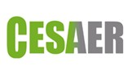
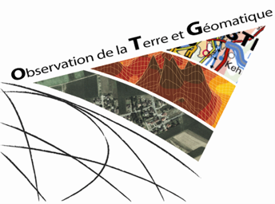
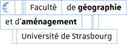

<table width="100%">
  <tr>
    <td align="left">
      
    </td>
    <td align="right">
      
      
    </td>
  </tr>
</table>

# Variabilité structurelle de la canopée viticole en Gironde : Analyse des facteurs agro-environnementaux à partir du LiDAR HD

Ce dépôt contient le code source développé dans le cadre du mémoire de Master 2 "Observation de la Terre et Géomatique" (Université de Strasbourg). L'étude porte sur la caractérisation de l'architecture du couvert végétal dans le vignoble girondin à l'aide de données LiDAR Haute Densité IGN, et sur l'analyse de ses déterminants environnementaux et anthropiques.

Le mémoire de recherche complet ainsi que l'ensemble des scripts Python et R développés dans le cadre de cette étude sont disponibles au sein de ce dépôt.

## Objectifs

L'objectif de ce projet est de modéliser la variabilité structurelle des parcelles viticoles en croisant des métriques dérivées du LiDAR avec des variables topographiques et agronomiques. La méthodologie repose sur une chaîne de traitement géomatique complète, de la donnée brute à la modélisation statistique multivariée.

Les objectifs spécifiques du code incluent :
* Le prétraitement des nuages de points LiDAR (génération de MNT locaux par interpolation IDW k-NN et calcul de Modèles de Hauteur de Canopée - CHM).
* L'extraction de métriques structurelles à l'échelle de la parcelle (hauteur moyenne, hétérogénéité, couverture spatiale normalisée).
* L'extraction de variables topographiques par statistiques zonales (Altitude, Pente, Exposition, TWI) à partir du RGE ALTI (5m).
* L'intégration et le filtrage des données déclaratives agronomiques (Casier Viticole Informatisé - CVI).
* L'analyse statistique des profils morphologiques (ANOVA, corrélations de Pearson, Analyse en Composantes Principales - ACP, et Classification Ascendante Hiérarchique - CAH).

## Données mobilisées

Le pipeline de traitement a été conçu pour exploiter les sources de données suivantes :
* **Parcellaire Express et ADMIN EXPRESS**
* **LiDAR HD** : Institut National de l'Information Génographique et Forestière (IGN).
* **Topographie** : RGE ALTI® 5m (IGN).
* **Agronomie** : Casier Viticole Informatisé (CVI).
* **Occupation du sol** : OpenStreetMap (OSM) et CoSIA.

## Organisation du code et scripts

L'ensemble des scripts Python et R est regroupé dans le dossier `code`. Le tableau ci-dessous synthétise la fonction de chaque script ainsi que sa section de rattachement au sein du mémoire de recherche.

| Script | Utilité | Section associée |
| :--- | :--- | :---: |
| **INVENTAIRE_DALLES_GRIONDE** | Inventaire des dalles LiDAR disponibles sur le territoire girondin | IV.3.2 |
| **WORKFLOW_LIDAR** | Parcelles candidates inventaire + pipeline principal de traitement LiDAR (génération MNT, normalisation, CHM, masques de végétation) | IV.3.1 / IV.4 |
| **COMPARAISON_MNT_IDW_ET_IGNTIN** | Comparaison et validation du MNT IDW k-NN par rapport au MNT IGN (TIN) | IV.4.3 |
| **VALIDATION_PERIMETRE_CANDIDATE** | Croisement des référentiels OSM/CoSIA, CVI et masque M2 pour la validation du périmètre parcellaire | IV.5 |
| **METRIQUE_VEGETATION** | Extraction des métriques structurelles de la canopée (*hmean*, *hstd*, *canopy_cover*) | IV.6 |
| **PRETRAITEMENT_METRIQUE_TOPO_GIRONDE** | Génération des bandes raster topographiques dérivées du MNT (pente, orientation, TWI) | IV.7.1 |
| **METRIQUE_TOPOGRAPHIQUE** | Calcul des indicateurs topographiques | IV.7.1 |
| **METRIQUE_CVI_LIDAR** | Intégration des métadonnées d'acquisition LiDAR (date), des données agronomiques du CVI (cépage, AOP, âge de la vigne) et calcul du *canopy_cover* normalisé | IV.7.3 / IV.8.2 |
| **ANALYSES_ORIENTATIONS_RANGS** | Protocoles A1/A2 d'estimation de l'orientation des rangs | IV.7.3 |
| **ANALYSE_UNI_MULTI** | Analyses statistiques (avec filtrages) univariées et multivariées (corrélations, ANOVA, ACP, CAH) | IV.8 |

## Contexte du projet
* **Auteur :** Théo Liegeon
* **Structure d'accueil :** CESAER (UMR1041 INRAE - Institut Agro Dijon)
* **Partenaire académique :** Laboratoire Image, Ville, Environnement (UMR7362 CNRS-Unistra)
* **Année :** 2025 - 2026

*Ce code est fourni à des fins d'évaluation académique et de documentation méthodologique.*

  
  

